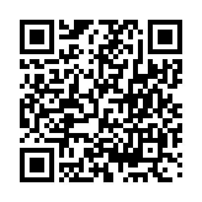

# sr-rules

> Shadowrocket 开箱即用配置 — 一键导入，自定义节点，开箱即用

[](https://github.com/transnull/sr-rules)
[](LICENSE)

---

## 特性亮点

| 特性 | 说明 |
|------|------|
| 🤖 AI 加速 | ChatGPT、Claude、Gemini 等主流 AI 服务专属节点 |
| 🔍 谷歌服务 | 优先日本节点，可手动切换香港节点 |
| 🍎 苹果优化 | iCloud、Push 域名直连，照片同步更流畅 |
| 🛡️ 广告拦截 | 自动拒绝广告域名请求 |
| ⚡ 极速体验 | cproxy 加速 GitHub 规则下载，拒绝超时 |

---

## 快速开始

**1. 复制配置链接**

```
https://raw.githubusercontent.com/vulnnull/proxy-configs/main/sr-rules/sr.conf
```

**2. 导入 Shadowrocket**

```
Shadowrocket → 配置 → 右上角 `+` → 粘贴链接 → 下载
```

**3. 启用配置**

点击已下载的配置，打上 ✔️ 标记设为使用中

**4. 添加节点**

首页 → 添加节点或订阅 → 连通性测试 → 选择可用节点

**5. 扫码导入**（可选）



---

## 默认策略速览

| 服务 | 🌟 默认策略 | 可选 |
|------|-----------|------|
| 🔍 谷歌服务（含 Gemini） | 🇯🇵 日本节点 | 🇭🇰 香港节点 |
| 🤖 AI 服务（ChatGPT / Claude） | 🇺🇸 美国节点 | 节点选择 |
| 🍎 苹果推送 | 🚀 节点选择 | PROXY / DIRECT |
| 🍏 苹果服务 | DIRECT | 节点选择 |
| 🌍 非中国（境外流量） | 🇯🇵 日本节点 | 节点选择 |
| 🐟 漏网之鱼（兜底） | 🇯🇵 日本节点 | 节点选择 |

---

## 策略组说明

| 策略组 | 类型 | 说明 |
|--------|------|------|
| 🚀 节点选择 | 手动选择 | 主策略，手动切换节点或分组 |
| 🇭🇰 香港节点 | 自动测速 | 按名称关键词匹配香港节点 |
| 🇹🇼 台湾节点 | 自动测速 | 按名称关键词匹配台湾节点 |
| 🇯🇵 日本节点 | 自动测速 | 按名称关键词匹配日本节点 |
| 🇺🇸 美国节点 | 自动测速 | 按名称关键词匹配美国节点 |
| 🌐 其他节点 | 自动测速 | 匹配非特定地区的所有节点 |

> 💡 **提示**：地区分组按节点名称关键词自动匹配，请确保节点名称包含地区标识（如 🇭🇰、HK、香港、东京、洛杉矶 等）

---

## 分流规则优先级

规则按**由上到下**顺序匹配，命中即执行。

| # | 服务 | 默认策略 |
|---|------|----------|
| 1 | 🧩 私人直连 | DIRECT（直连） |
| 2 | 🧩 私人代理 | 🚀 节点选择 |
| 3 | 🛑 广告拦截 | REJECT（拒绝） |
| 4 | 🔍 谷歌服务（含 Gemini） | 🇯🇵 日本节点 |
| 5 | 🤖 AI 服务（ChatGPT / Claude 等） | 🇺🇸 美国节点 |
| 6 | 📹 油管视频 | 🚀 节点选择 |
| 7 | 🏠 私有网络 / 局域网 | DIRECT（直连） |
| 8 | 📲 电报消息 | 🚀 节点选择 |
| 9 | 🐱 代码托管（GitHub / GitLab） | 🚀 节点选择 |
| 10 | Ⓜ️ 微软服务 | 🚀 节点选择 |
| 11 | 🍎 苹果推送 | 🚀 节点选择 |
| 12 | 🍏 苹果服务 | DIRECT（直连） |
| 13 | 🔒 国内服务 | DIRECT（直连） |
| 14 | 🌍 非中国（境外流量） | 🇯🇵 日本节点 |
| 15 | 🌐 GEOIP CN | DIRECT（直连） |
| 16 | 🐟 漏网之鱼（兜底） | 🇯🇵 日本节点 |

---

## 规则集来源

| 来源 | 用途 |
|------|------|
| [blackmatrix7/ios_rule_script](https://github.com/blackmatrix7/ios_rule_script) | 主要规则集（广告、YouTube、Telegram、GitHub、微软等） |
| [iab0x00/ProxyRules](https://github.com/iab0x00/ProxyRules) | AI 服务补充规则 |
| 本仓库维护 | `AI.list` / `Google.list` / `Apple.list` / `ApplePush.list` / `PrivateDirect.list` / `PrivateProxy.list` |

> `Apple.list` 基于 blackmatrix7 Apple 规则，额外补充了 iCloud Photos、CloudKit、Apple CDN 相关域名，进一步优化 iCloud 照片同步体验。

---

## 技术特性

- **DNS** — DoH（DNSPod + AliDNS）加密查询 + 传统 DNS 双备份
- **DNS 劫持** — 拦截 8.8.8.8 / 8.8.4.4 硬编码请求，防止 DNS 绕过
- **QUIC 屏蔽** — 对代理连接屏蔽 UDP/443，强制回退 HTTP/2
- **微信本地保护** — `localhost.weixin.qq.com` 强制直连至 `127.0.0.1`，避免 fake-IP 干扰微信本地回调
- **Google 防跳转** — `google.cn` / `g.cn` 自动 302 重定向至 `google.com`
- **证书解密（MITM）** — 仅对 `*.google.cn` 启用 HTTPS 解密

---

## 注意事项

1. 地区分组依赖节点名称关键词匹配，请确保节点名称包含地区标识
2. Google、AI、非中国、漏网之鱼的默认出口可在 App 内**手动切换**
3. Google、AI、非中国、漏网之鱼的默认出口可在 App 内**手动切换**
4. `PrivateDirect.list` / `PrivateProxy.list` 为用户个人维护规则，且在配置中拥有最高优先级
5. 如需 HTTPS 解密功能，请在 Shadowrocket 中生成并安装 CA 证书

---

## License

[Mit License](LICENSE) — 可自由使用、修改和分发